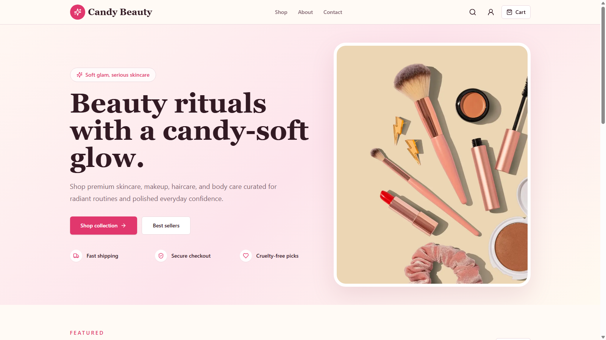
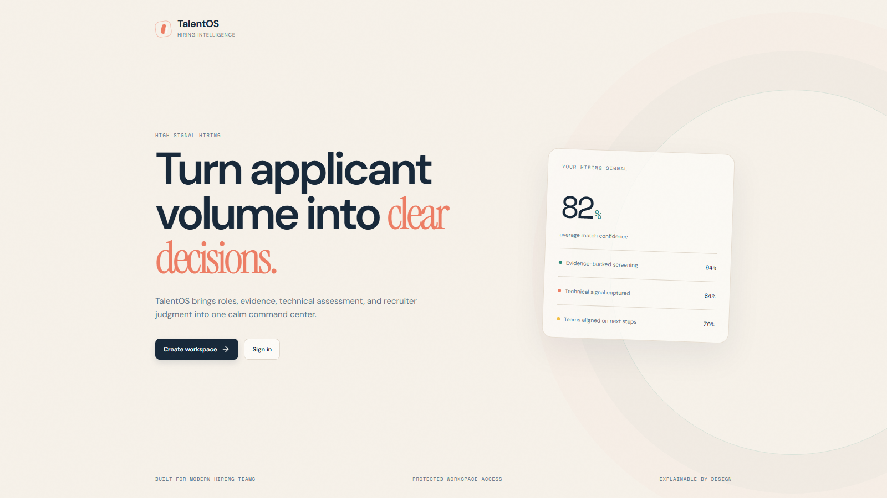
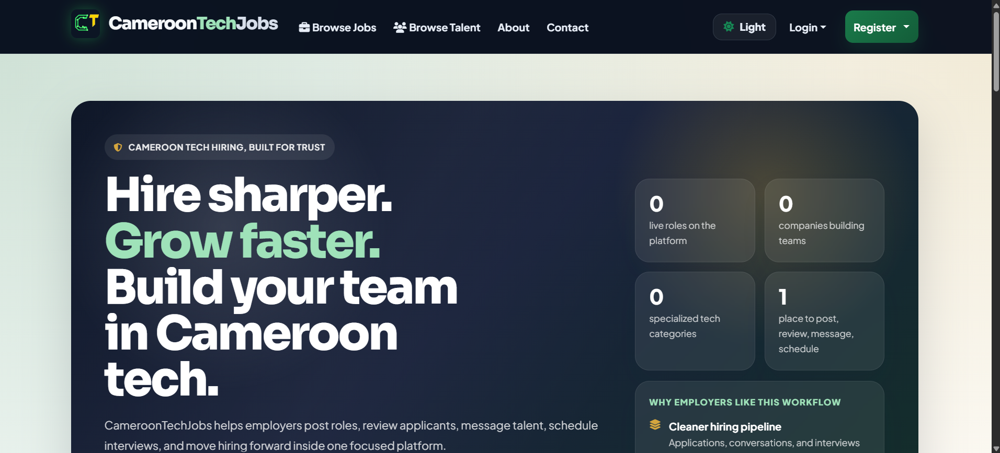

# FOKOUA PAUL EMMANUEL - Portfolio

A recruiter-focused engineering portfolio for Fokoua Paul Emmanuel, a Backend and Full-Stack Software Engineer based in Douala, Cameroon.

Live site: https://paulfokoua-dev.vercel.app
GitHub: https://github.com/Chipser-Paul
LinkedIn: https://www.linkedin.com/in/fokoua-paul-emmanuel

[](https://github.com/Chipser-Paul/paulfokoua.dev/actions/workflows/ci.yml)


## What This Portfolio Shows

- Backend and full-stack project case studies
- Live deployed products with screenshots and source links
- Resume content structured for hiring managers
- Experience, education, technical strengths, and contact routes
- Recruiter quick-scan sections for fast evaluation

## Project Previews

| Candy Beauty | TalentOS | Cameroon Tech Jobs |
| --- | --- | --- |
|  |  |  |

## Featured Work

- Candy Beauty - Cameroon-focused beauty e-commerce store with Next.js, TypeScript, Prisma, PostgreSQL, NextAuth, Stripe test checkout, FCFA pricing, and protected admin tools.
- TalentOS - AI recruitment platform with React, Express, TypeScript, PostgreSQL, Drizzle, OpenAI workflows, Docker, CI, and tested API behavior.
- Cameroon Tech Jobs - Django job board for Cameroon tech hiring with company/seeker dashboards, applications, interviews, notifications, and deployment on Render.
- Forex Signal Bot - Python/MetaTrader 5 trading research system with SMC-style analysis, risk management, backtesting, and dashboard tooling.

## Tech Stack

- Next.js 15 App Router
- React 19
- JavaScript
- Tailwind CSS 4
- Lucide React
- Framer Motion
- next-themes
- EmailJS contact form

## Project Structure

```text
app/                  Next.js routes
components/           UI, layout, cards, navigation, and page sections
content/              JSON-driven profile, projects, skills, education, timeline, and experience data
lib/                  Loaders, constants, and helpers
public/images/        Project screenshots and visual assets
styles/               Global Tailwind theme tokens
```

## Local Setup

```bash
npm install
npm run dev
```

Open:

```text
http://localhost:3000
```

## Production Build

```bash
npm run lint
npm run build
npm run start
```

## Environment Variables

Create `.env.local` if you want the contact form to send messages through EmailJS:

```env
NEXT_PUBLIC_EMAILJS_PUBLIC_KEY=""
NEXT_PUBLIC_EMAILJS_SERVICE_ID=""
NEXT_PUBLIC_EMAILJS_TEMPLATE_ID=""
```

The site still builds without these values; the contact form displays a fallback error if EmailJS is not configured.

## Hiring Manager Notes

This portfolio is intentionally content-driven. The project data lives in JSON files so case studies, links, stack information, and screenshots can be updated without rewriting page components.

## License

MIT
